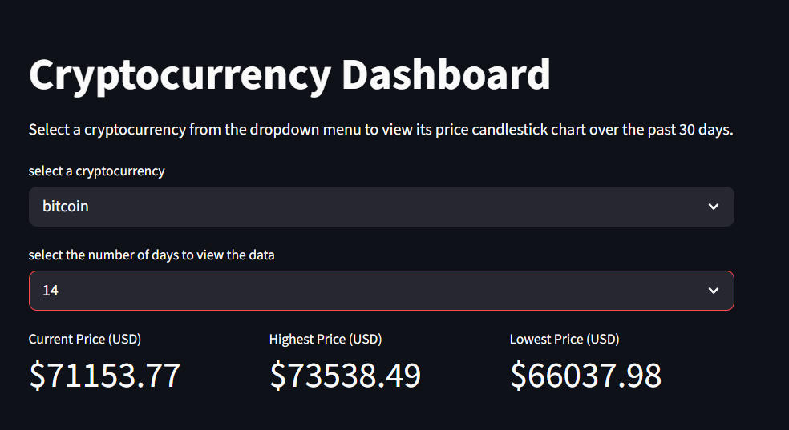
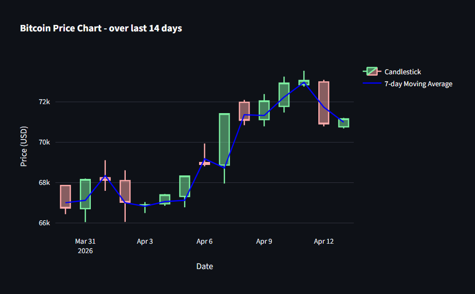
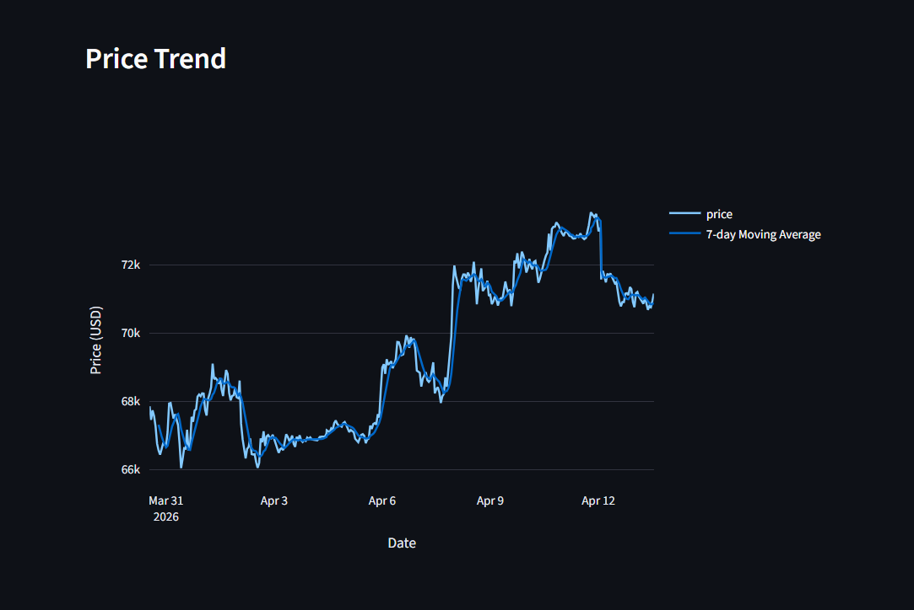

# 📊 Crypto Currency Dashboard

An interactive data analytics dashboard built using Python, Streamlit, and Plotly to visualize cryptocurrency price trends.

## 🚀 Features
- Fetches real-time cryptocurrency data using CoinGecko API
- Supports multiple cryptocurrencies (Bitcoin, Ethereum, Solana)
- Interactive candlestick charts
- 7-day moving average trend line
- Dynamic time range selection (7, 15, 30 days)
- Key metrics:
  - Current Price
  - Highest Price
  - Lowest Price

## 🛠️ Tech Stack
- Python
- Pandas
- Plotly
- Streamlit
- CoinGecko API

## 📸 Dashboard Preview





## ▶️ Run Locally

```bash
pip install -r requirements.txt
streamlit run app.py
